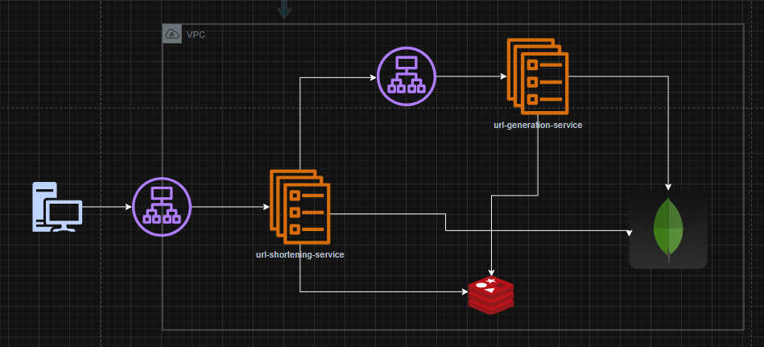
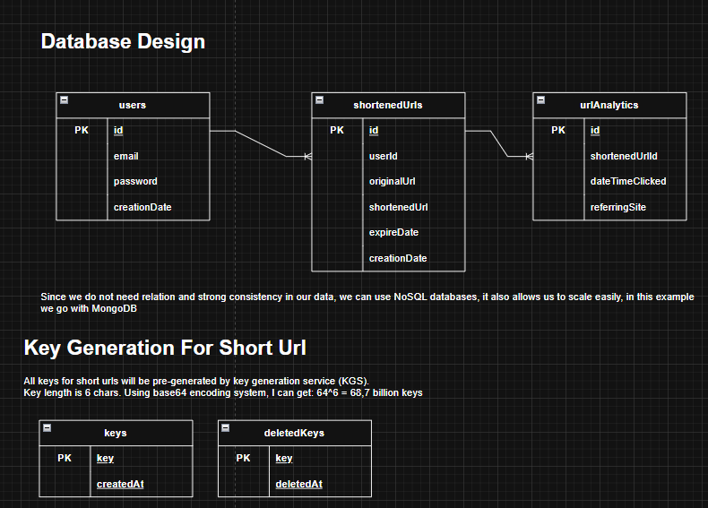

# URL Shortening Service

A prototype URL-shortening system with a dedicated key-generation service, Redis caching, and MongoDB persistence. This README summarizes the design and requirements captured in `url-shortening-service.drawio`.

## Requirements

### Functional

- Generate a short, unique alias for a given URL.
- Redirect a short link to the original URL.
- Allow users to pick a custom short link (optional).
- Support default and custom expiration for links.

### Non-functional

- High availability (redirects should not fail due to downtime).
- Low-latency redirects.
- Short links should be hard to guess.
- Analytics for redirects.
- REST APIs for external integration.

## Back-of-the-envelope estimates

- 500M new URLs/month (~193 write req/s).
- Read/write ratio ~100:1 (~19.3K redirects/s).
- ~15 TB data for 5 years (assuming 500 bytes per URL).
- Write bandwidth ~97 KB/s, read bandwidth ~9.7 MB/s.
- Hot cache size ~170 GB (20/80 rule).

## System overview

- **url-shortening-service** handles user auth, URL creation, redirect, and analytics.
- **url-generation-service** (key-generation service) pre-generates short keys and serves them via gRPC.
- **MongoDB** stores users, shortened URLs, analytics, and key pools.
- **Redis** caches hot URL lookups and available short keys.
- **ALB** (load balancer) fronts both services.

## API surface (design intent)

- `POST /users/register` — Register a user.
- `POST /users/login` — Authenticate and obtain access token.
- `POST /urls` — Create a shortened URL.
- `GET /urls/redirect` — Redirect to the original URL.
- `GET /urls/analytics/{shortened_url}` — Analytics for a short link.
- `DELETE /urls/{shortened_url}` — Delete a short URL (secured).
- `GET /urls/{user_id}/urls` — List user URLs (secured).

## Data model (MongoDB)

### users

- `id` (PK)
- `email`
- `password`
- `creationDate`

### shortenedUrls

- `id` (PK)
- `userId`
- `originalUrl`
- `shortenedUrl`
- `expireDate`
- `creationDate`

### urlAnalytics

- `id` (PK)
- `shortenedUrlId`
- `dateTimeClicked`
- `referringSite`

### keys

- `key` (PK)
- `createdAt`

### deletedKeys

- `key` (PK)
- `deletedAt`

## Key generation flow

- Keys are pre-generated (length 6, Base64 alphabet).
- Capacity: 64^6 ≈ 68.7B unique keys.
- Keys are stored in `keys`, moved to `deletedKeys` after use.
- Redis caches **N** keys for fast retrieval.
- Redis refills use distributed locking to avoid double fetch.
- Some key loss is acceptable if Redis fails (key space is large).

## Create short URL flow (high level)

1) Client → public ALB.
2) ALB → url-shortening-service.
3) url-shortening-service → gRPC call to url-generation-service.
4) url-generation-service checks Redis cache:
   - If non-empty: return key.
   - If empty: refill from MongoDB, then return key.
5) url-shortening-service stores shortened URL document.
6) Response returned to client.

## Redirect flow (high level)

1) Client requests short URL.
2) url-shortening-service checks Redis cache:
   - If miss: load from MongoDB and cache.
   - If hit: proceed.
3) Update analytics.
4) Return HTTP redirect.

## Operational notes

- Redis configured for LFU eviction with a 20 GB max data target.
- MongoDB and Redis authentication are listed as future improvements.

## Improvements (from diagram)

- Stronger auth (current username/password is basic).
- Secure MongoDB and Redis with auth.
- Reuse deleted keys (optional).
- Audit and cleanup expired URLs.
- Add input validation (email, password, URL).
- This is a prototype, not a production-ready design.

